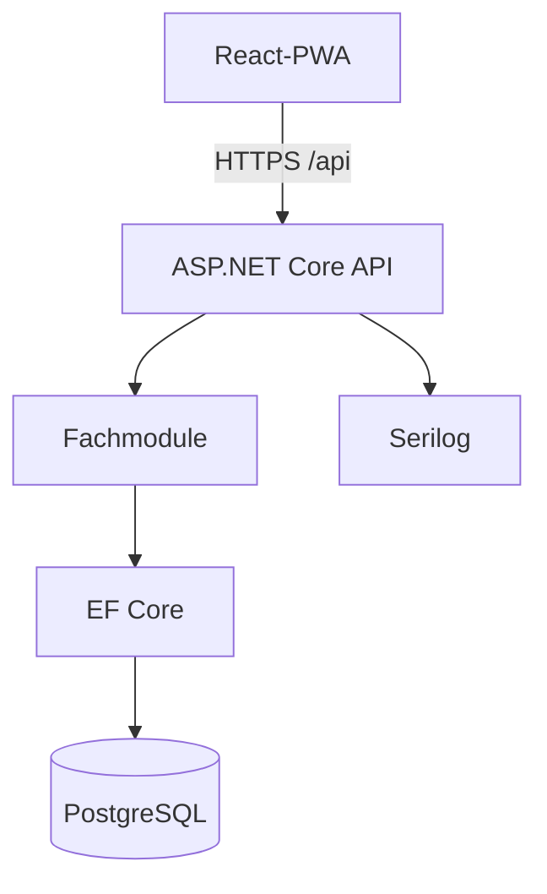

# Architektur

## Ziel und Kontext

Community Intranet ist eine mandantenfähige Webplattform für kleine, private
Communities. Die gleiche Anwendung soll ein neutrales Vereinsportal, ein
humorvolles Firmen-Intranet oder ein thematisches Gaming-Portal darstellen
können. Das fachliche Verhalten bleibt generisch; Theme Packs verändern
Terminologie, Vorschläge und Darstellung.

Die erste Ausbaustufe wird als modularer Monolith umgesetzt. Das vermeidet den
Betriebsaufwand von Microservices, hält Fachgrenzen aber so sichtbar, dass ein
späterer Schnitt möglich bleibt.

## Laufzeitübersicht



Frontend und Backend werden getrennt gebaut und im Development über den
Vite-Proxy verbunden. Das Backend ist der einzige vertrauenswürdige
Sicherheitsrand. Das Frontend darf Berechtigungen für die Bedienbarkeit
ausblenden, aber niemals durchsetzen.

## Modulgrenzen

| Modul | Verantwortung | Eigene Kerntypen |
|---|---|---|
| Identity | Benutzer, Zugangsdaten, Access-/Refresh-Token | User, RefreshToken |
| Organizations | Mandant, Einstellungen, aktivierte Module | Organization |
| Members | Mitgliedschaft, Abteilungen, Einladungen | OrganizationMember, Department, Invitation |
| ThemePacks | validierte Darstellung und Terminologie | ThemePack, ThemePackConfiguration |
| Projects | größere gemeinsame Vorhaben | Project |
| Tasks | eigenständige und projektbezogene Aufgaben | Task |
| Incidents | Vorfälle, Untersuchung und Auflösung | Incident |
| Awards | Vorlagen und vergebene Auszeichnungen | Award |
| ActivityFeed | strukturierte, renderbare Domain-Aktivitäten | Activity |

Ein Modul greift nicht direkt auf interne Domain-Typen eines anderen Moduls zu.
Notwendige Kommunikation erfolgt zunächst synchron über kleine öffentliche
Verträge. Domain Events werden pro Request gesammelt und innerhalb derselben
Datenbanktransaktion in ein Outbox-kompatibles Activity-Modell überführt. Ein
externer Message Broker ist für die aktuelle Größe nicht gerechtfertigt.

## Projekt- und Abhängigkeitsregeln

```text
CommunityIntranet.Api
  -> Module.*
  -> Infrastructure
  -> BuildingBlocks

Module.*
  -> BuildingBlocks
  -> kleine öffentliche Verträge anderer Module, wenn fachlich nötig

Infrastructure
  -> BuildingBlocks
  -> Identity, Organizations und Members für EF-Konfigurationen
```

- `Api` ist Composition Root und besitzt keine Fachlogik.
- `BuildingBlocks` enthält nur kleine, fachübergreifend stabile Typen.
- Fachmodule besitzen Endpunkte, Anwendungsfälle, Domain-Typen und ihre
  EF-Core-Konfigurationen.
- `Infrastructure` enthält den gemeinsamen DbContext, Identity-Stores und
  technische Adapter. Es lädt die EF-Konfigurationen der Fachmodule.
- Es gibt kein generisches Repository; Anwendungsfälle verwenden EF Core direkt.
- API-DTOs, Domain-Modelle und Persistenzkonfigurationen bleiben getrennt.

## Persistenz

Eine PostgreSQL-Instanz und ein gemeinsamer EF-Core-DbContext erlauben
Transaktionen über mehrere Module. Tabellen werden nach Modul in Schemas
gruppiert (`identity`, `organizations`, `members`, `theme_packs`, `projects`,
`tasks`, `incidents`, `awards`, `activity`).

Jede mandantenbezogene Tabelle besitzt `organization_id`. Eindeutigkeiten werden
wo nötig zusammen mit `organization_id` definiert. Globale Ausnahmen sind unter
anderem Benutzer-E-Mail, Organisations-Slug sowie Theme-Pack-Key und -Version.

Migrationen liegen zentral im Infrastructure-Projekt, enthalten aber
Konfigurationen aus den jeweiligen Modulen. Lokal und im dokumentierten
Produktions-Compose werden vorhandene Migrationen beim Start automatisch
angewendet. Für größere Installationen kann dieser Schritt später in einen
separaten Deployment-Job verschoben werden.

## Mandantenauflösung

Ab Phase 3 läuft jeder organisationsbezogene Request durch dieselbe Kette:

1. JWT authentifiziert den Benutzer.
2. Die Route liefert die angeforderte `organizationId`.
3. Ein Tenant-Accessor lädt die aktive Mitgliedschaft des Benutzers.
4. Ein Permission-Service prüft die benannte technische Berechtigung.
5. Jede EF-Abfrage filtert zusätzlich explizit nach `OrganizationId`.
6. Schreibmodelle übernehmen `OrganizationId` aus dem geprüften Kontext, nicht
   aus dem Request-Body.

Globale EF-Filter allein sind keine ausreichende Sicherheitsgrenze. Die
explizite Filterung bleibt im Anwendungsfall sichtbar und wird durch
Integrationstests zwischen zwei Organisationen abgesichert.

## Frontend

- TanStack Query verwaltet sämtlichen Serverzustand und Cache-Invalidierungen.
- React Router verwaltet öffentliche und organisationsbezogene Routen.
- Zustand ist nur für lokalen UI-State wie Sidebar oder Dialoge vorgesehen.
- React Hook Form und Zod bilden Formulare und Clientvalidierung.
- i18next lokalisiert neutrale UI-Texte und rendert strukturierte Activities.
- Theme-Werte werden als validierte CSS Custom Properties am App-Root gesetzt.
- Die PWA ist zunächst installierbar; Offline-Schreibvorgänge sind nicht Teil
  des MVP, um Konflikte und irreführende Bestätigungen zu vermeiden.

## Wichtige Architekturentscheidungen

### ADR-001: Modularer Monolith

Entscheidung: Ein deploybares Backend statt einzelner Dienste.

Grund: geringe Team- und Betriebsgröße, einfache lokale Entwicklung,
Transaktionen über Modulgrenzen.

Konsequenz: Modulgrenzen werden durch Projektverweise und Architekturtests
geschützt, nicht durch Netzwerkgrenzen.

### ADR-002: Organisation als Tenant

Entscheidung: `OrganizationId` ist der fachliche Tenant-Schlüssel.

Grund: Ein Benutzer kann mehreren Organisationen angehören.

Konsequenz: Kein Tenant wird aus einem frei gesetzten Header vertraut; Route,
Mitgliedschaft und Token-Identität werden gemeinsam geprüft.

### ADR-003: Theme Packs sind Daten

Entscheidung: Theme Packs bestehen aus versionierter, fest typisierter und
serverseitig validierter Konfiguration.

Grund: Gestaltung ohne Codeausführung oder Plugin-Sicherheitsrisiko.

Konsequenz: keine Scripts, kein HTML und keine frei ladbaren CSS-Dateien.

### ADR-004: Strukturierte Activities

Entscheidung: Aktivitäten speichern Ereignistyp und Daten, keine fertigen
lokalisierten Sätze.

Grund: Übersetzung, Umbenennung durch Theme Packs und spätere Renderer bleiben
möglich.

Konsequenz: Renderer müssen unbekannte Ereignisversionen robust behandeln.

## Technische Risiken

| Risiko | Auswirkung | Gegenmaßnahme |
|---|---|---|
| Tenant-Leak durch vergessenen Filter | kritisch | zentraler Accessor, explizite Filter, Isolationstests |
| Rolle und sichtbarer Titel werden vermischt | Rechteausweitung | getrennte Felder und Permission-Mapping nur aus PermissionRole |
| Theme-Konfiguration wächst unkontrolliert | instabile UI | versioniertes Schema, Größenlimits, Allowlist für Icons/Werte |
| Gemeinsamer DbContext koppelt Module | erschwerte Extraktion | Schema- und Projektgrenzen, keine Navigationen über Aggregate |
| Refresh-Token-Wiederverwendung | Kontoübernahme | Hashing, Rotation, Token-Familie und Reuse-Erkennung |
| PWA cached sensible API-Antworten | Daten auf geteilten Geräten | Network-only für `/api`, Cache nur statische Assets |
| humorvolle Drittanbieter-Themes verletzen Rechte | rechtliches Risiko | eigene Icons/Assets, Autorenangabe, Moderation und Exportprüfung |

## Umsetzungsreihenfolge

1. Grundgerüst, Beobachtbarkeit und CI
2. Identity, Tokens und Organisationen
3. Theme-Pack-Modell und Seed-Packs
4. Mitglieder, Abteilungen und Einladungen
5. Projekte und Aufgaben
6. Incidents und Awards
7. Activity Feed und Dashboard
8. Isolationstests, responsive Stabilisierung und Deployment
