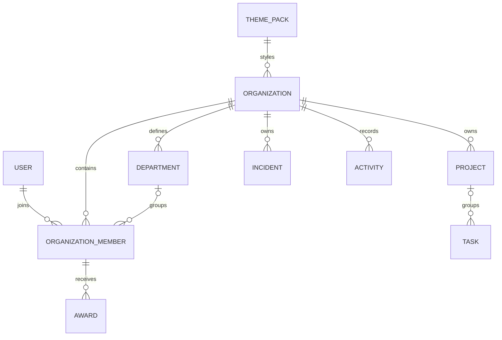

# Domain-Modell

## Modellierungsregeln

- IDs sind `Guid`.
- Persistierte Zeitstempel sind UTC (`DateTimeOffset`).
- Tenant-Entities implementieren fachlich `IOrganizationScoped`.
- API-Modelle werden nicht direkt als EF-Entities verwendet.
- Editierbare Aggregate erhalten einen Concurrency-Token.
- Soft Delete wird nur genutzt, wenn Historie fachlich erforderlich ist.
- technische Permission-Rollen und sichtbare Titel sind getrennte Werte.

## Beziehungen

## Aggregate und Eigentümerschaft

### Identity

`User` ist global und besitzt E-Mail, Anzeigename, Avatar, Erstell- und
Loginzeitpunkt. Passwort-Hashes werden von ASP.NET Core Identity verwaltet.

`RefreshToken` gehört zu genau einem Benutzer und einer Token-Familie. Gespeichert
wird nur ein kryptografischer Hash. Rotation widerruft den Vorgänger atomar.

### Organizations

`Organization` ist Tenant-Root und besitzt Name, global eindeutigen Slug,
Beschreibung, Theme-Pack-Referenz, Sprache, Zeitzone, Owner und aktivierte
Module. Archivierung ist ein fachlicher Soft Delete; archivierte Organisationen
bleiben für Owner exportierbar, nehmen aber keine Änderungen mehr an.

### Members

`OrganizationMember` verbindet Benutzer und Organisation eindeutig. Die
technische Rolle ist eines von `Owner`, `Administrator`, `Moderator`, `Member`
oder `Guest`. `VisibleTitle` ist ausschließlich Inhalt.

`Department` gehört zur Organisation und darf archiviert werden, weil historische
Mitglieder- und Activity-Daten die Bezeichnung weiterhin benötigen.

`Invitation` gehört zur Organisation. In der Datenbank liegt ein Hash des
zufälligen Tokens; der Klartext wird nur einmal im erzeugten Link ausgegeben.
Maximalnutzung und Ablauf werden atomar geprüft.

### Theme Packs

`ThemePack` ist global, versioniert und unveränderlich, sobald Organisationen
darauf verweisen. Eine Änderung erzeugt eine neue Version. Die Konfiguration ist
fest typisiert; die JSON-Spalte ist nur das Persistenzformat.

### Fachmodule

| Typ | Aggregate-Root | Lebenszyklus-Besonderheit |
|---|---:|---|
| Project | ja | Statuswechsel setzt `CompletedAt`; Löschung nur vor relevanter Historie |
| Task | ja | Projekt optional; Abschlusszeit folgt Status |
| Incident | ja | Auflösung benötigt Resolution; Historie bleibt erhalten |
| Award | ja | vergebene Awards werden nicht umgeschrieben, sondern ggf. zurückgezogen |
| Activity | ja, append-only | strukturierte Daten mit Schema-/Eventversion |
| WorkPlanDraft | ja | kurzlebig; Bestätigung erzeugt Projekt und Aufgaben genau einmal |

## Invarianten und Constraints

| Invariante | Durchsetzung |
|---|---|
| E-Mail global eindeutig | normalisierter Unique Index aus Identity |
| Organisations-Slug global eindeutig | Unique Index |
| Mitglied nur einmal je Organisation | Unique `(OrganizationId, UserId)` |
| Theme-Key und Version eindeutig | Unique `(Key, Version)` |
| Einladungstoken eindeutig | Unique auf Token-Hash |
| Fachreferenzen gehören zum selben Tenant | Anwendungsservice plus zusammengesetzte Prüfung |
| nur ein aktiver Owner | Transaktion und Rollenwechsel-Anwendungsfall |
| UTC-Zeitstempel | `TimeProvider` und PostgreSQL `timestamptz` |
| Status/CompletedAt konsistent | Domain-Methode und Datenbank-Check soweit sinnvoll |

## Löschregeln

- Benutzer werden nicht kaskadierend aus Organisationen gelöscht; Accounts
  werden zunächst deaktiviert/anonymisiert.
- Organisationen werden archiviert, nicht physisch gelöscht.
- Departments werden archiviert.
- Projekte und Tasks dürfen nur ohne relevante Activity-/Audit-Historie physisch
  entfernt werden; ansonsten wird ein fachlicher Cancelled-Status verwendet.
- Incidents, Awards und Activities werden nicht kaskadierend gelöscht.

## Optimistic Concurrency

Organisation, Mitglied, Projekt, Task und Incident erhalten einen durch EF Core
verwalteten Concurrency-Token. Ein Konflikt wird als `409 Conflict` mit
ProblemDetails zurückgegeben. Der Client lädt den aktuellen Stand neu und lässt
den Benutzer bewusst erneut entscheiden.

## Modulübergreifende Referenzen

Fremdschlüssel über Modulgrenzen werden auf IDs beschränkt. Fachmodule laden
nicht das vollständige fremde Aggregate. Anzeigenamen in Antworten werden über
gezielte Projektionen oder Read Models ergänzt. Activities speichern notwendige
historische Anzeigedaten strukturiert, aber keine lokalisierten Sätze.
