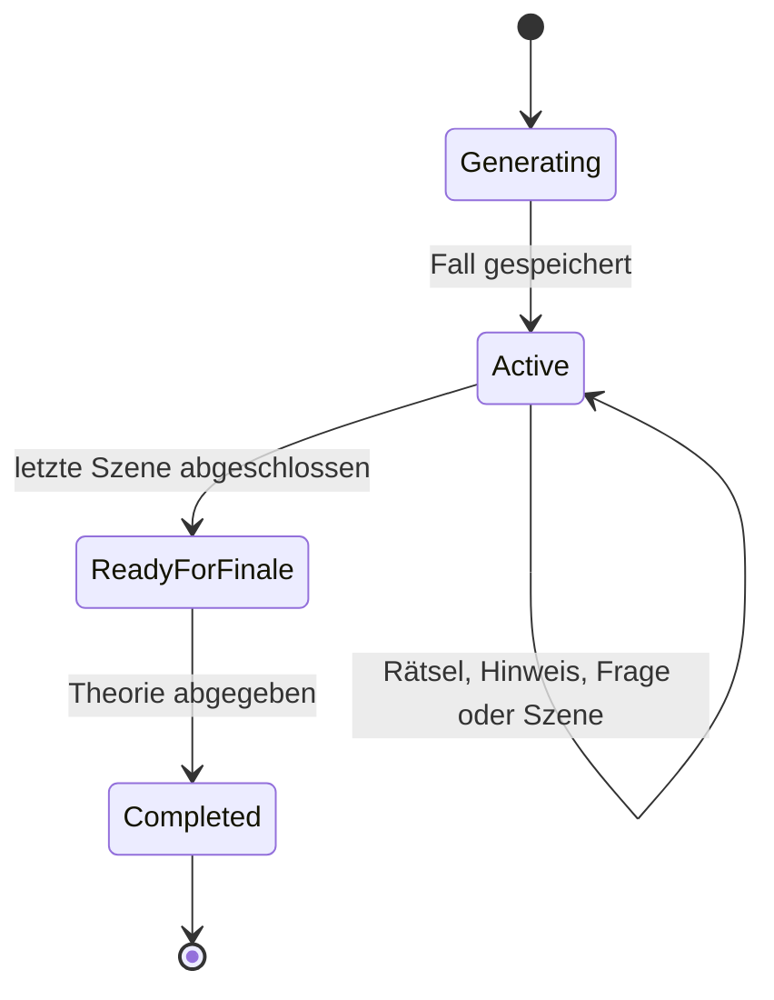

# Mystery-Spiel (`/mistery`)

## Ziel und Einordnung

Das Mystery-Spiel ist ein eigenständiges Fachmodul innerhalb des bestehenden
Community-Intranet-Monolithen. Die öffentliche Route `/mistery` benötigt keine
Anmeldung. Ein Spiel kann über seine zufällige Sitzungs-ID oder einen kurzen
Beitrittscode auf mehreren Geräten im vertrauenswürdigen Heimnetz geöffnet
werden.

Die Schreibweise `mistery` ist bewusst Teil der öffentlichen URL und API. Im
Code wird für Fachbegriffe die korrekte englische Schreibweise `Mystery`
verwendet.

## Verzeichnisstruktur

```text
backend/CommunityIntranet.Modules.Mystery/
  Contracts/       öffentliche Request- und Response-Modelle
  Domain/          Session-Entity und interne Fall-/State-Modelle
  Endpoints/       öffentliche Minimal-API-Endpunkte
  Game/            deterministische State Machine und Spoiler-Schutz
  Persistence/     EF-Core-Modulgrenze und Tabellenkonfiguration
  Providers/       austauschbarer LLM-Provider und lokaler Fallback
frontend/src/
  api/mystery.ts   typisierter API-Client
  components/MysteryPage.tsx
  mystery.css      isolierte Noir-Oberfläche
```

Das Modul verwendet die vorhandene PostgreSQL-Datenbank und das Schema
`mystery`. Eine zusätzliche SQLite-Instanz würde im bestehenden Deployment zwei
Persistenzpfade, Backups und Fehlerbilder erzeugen, ohne einen Vorteil für den
Raspberry-Pi-Betrieb zu bringen.

## Datenmodell

Eine Zeile in `mystery.sessions` enthält:

- `Id` und zufälligen, eindeutigen `JoinCode`
- öffentlich sichtbaren Titel und Status
- `ConfigurationJson` mit Spielern, Dauer, Schwierigkeit und Ortsoptionen
- `SecretCaseJson` mit Täter, Motiv, Lösungen, zukünftigen Szenen und Finale
- `GameStateJson` mit Kapitel, Fortschritt, bekannten Informationen,
  Entscheidungen, Hinweisen, Notizen und Story-Flags
- Zeitstempel und ein Concurrency-Token für Änderungen von mehreren Geräten

`SecretCaseJson` wird niemals direkt auf ein API-Response-Modell abgebildet.
Nach einem Reload wird der öffentliche Zustand neu aus der gespeicherten
Session projiziert.

## Öffentliche API

| Methode | Route | Zweck |
| --- | --- | --- |
| `POST` | `/api/mistery/sessions` | Fall erzeugen und Session starten |
| `GET` | `/api/mistery/sessions/{id}` | freigegebenen Spielzustand laden |
| `GET` | `/api/mistery/sessions/code/{code}` | Beitrittscode auflösen |
| `POST` | `/api/mistery/sessions/{id}/advance` | zur nächsten Szene wechseln |
| `POST` | `/api/mistery/sessions/{id}/puzzle` | Rätsellösung prüfen |
| `POST` | `/api/mistery/sessions/{id}/decision` | Entscheidung speichern |
| `POST` | `/api/mistery/sessions/{id}/hints` | Hinweisstufe 1 bis 3 abrufen |
| `POST` | `/api/mistery/sessions/{id}/questions` | spoilerarme Frage an den Game Master |
| `PUT` | `/api/mistery/sessions/{id}/notes` | gemeinsame Notizen speichern |
| `POST` | `/api/mistery/sessions/{id}/finale` | Theorie abgeben und Fall auflösen |

Schreibende Requests können die zuletzt geladene `version` mitsenden. Wurde
der Zustand inzwischen auf einem anderen Gerät geändert, antwortet die API mit
`409 Conflict`, statt einen neueren Stand zu überschreiben.

## Game-State-Machine



Der Wechsel zur nächsten Szene ist nur möglich, wenn das aktuelle Rätsel gelöst
und eine erforderliche Entscheidung getroffen wurde. Beim Szenenwechsel deckt
die Engine ausschließlich die für diese Szene vorgesehenen Beweise,
Charaktere, Locations und Flags auf.

## LLM-Integration

`IMysteryLlmProvider` kapselt den Anbieter. Die erste Implementierung verwendet
die OpenAI Responses API mit einem strikten JSON-Schema. API-Key, Modell und
Endpoint werden serverseitig konfiguriert und niemals an den Browser gesendet.

Ohne API-Key steht für lokale Entwicklung ein kleiner, regelbasierter
Fallback-Fall zur Verfügung. Ein echtes Spiel sollte mit konfiguriertem
LLM-Provider erstellt werden, damit auch der Entwickler den generierten Fall
nicht vorab kennt.

Die KI erzeugt den vollständigen Fall, kontrolliert aber nicht die Progression.
Kapitelwechsel, Antwortprüfung, Freigaben und Finale werden deterministisch von
der Game Engine ausgeführt.

## Raspberry Pi

Unter `deploy/raspberry-pi` liegt ein ARM64-kompatibler Compose-Stack ohne den
optionalen x64-CS2-Demo-Analyzer. Nach dem Kopieren und Anpassen der dortigen
`.env.example` kann er aus diesem Verzeichnis mit `docker compose up -d --build`
gestartet werden. Die Anwendung ist anschließend ohne Domain im Heimnetz auf
Port `8080` erreichbar.

## Sicherheitsgrenzen

- Client-Responses verwenden eigene DTOs ohne Secret-State-Felder.
- Der vollständige Fall wird nur serverseitig deserialisiert.
- Fragen erhalten den geheimen Kontext ausschließlich innerhalb des
  Provider-Aufrufs; ein zusätzlicher Spoiler-Guard verwirft Antworten mit
  eindeutigen Lösungs- oder Zukunftsleaks.
- Hinweise werden aus dem aktuellen Szenen-/Rätselkontext gewählt und
  gespeichert.
- Freie Texte, Listenlängen und generierte Falldaten besitzen Größenlimits.
- Rate Limits schützen Fallerzeugung und KI-Fragen vor versehentlicher
  Überlastung.
- Keine API-Antwort enthält API-Keys, Prompt-Instruktionen oder das gespeicherte
  `SecretCaseJson`.
